# QWeather功能说明
QWeather是一个天气预测APP，接下来会逐一介绍APP
## 1、主页面
主页面显示一组城市的天气预报信息。

    

### 1.1、 顶部栏 
包含地图Button、搜索Button和更多功能Button。
#### 1.1.1、更多功能
点击更多按钮后，会弹出功能选项弹窗。包含"城市管理"、"搜索"、"天气信息"和"地图"功能。

    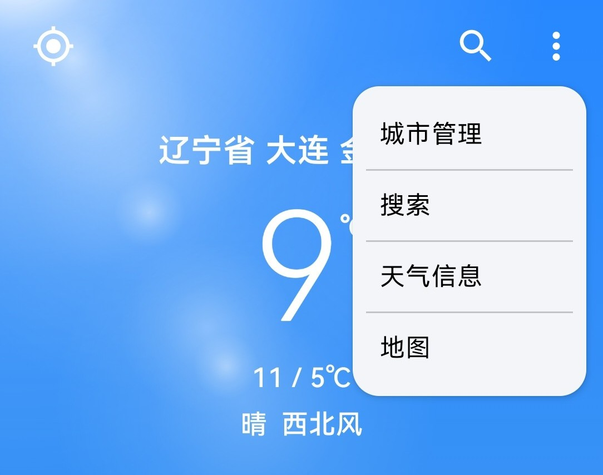

#### 1.1.2、地图信息
点击顶部栏左侧的地图按钮，会转跳到该城市的定位地图页面。

    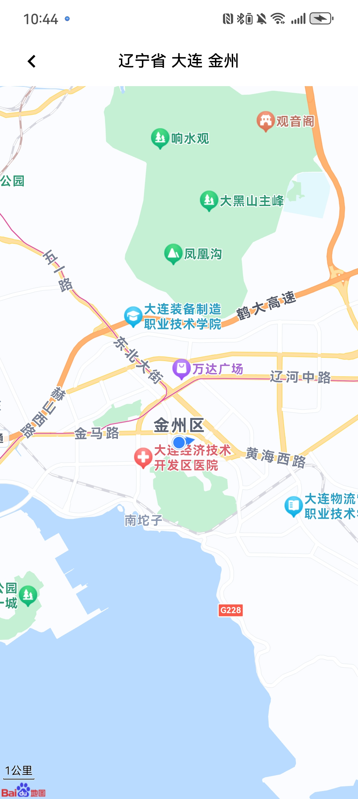

#### 1.1.3、搜索
点击搜索按钮，会转跳到搜索页面。
==搜索页面具体功能具体看下面“搜索功能”==
### 1.2、 **中心内容**
对于一个城市天气，页面会显示实时天气、生活小提示、天气预警通告、未来逐小时预报、未来逐天预报、空气质量以及生活指数的卡片组。
**-- tip --**: 点击卡片会转跳到“详细天气信息页面”的对应page中。

    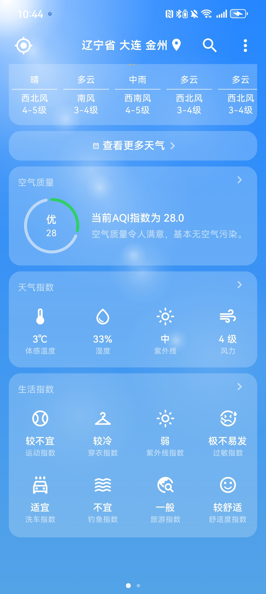

### 1.3、 **底部栏**
底部栏是一个**页面索引栏**，用于显示当前显示的城市的索引。

    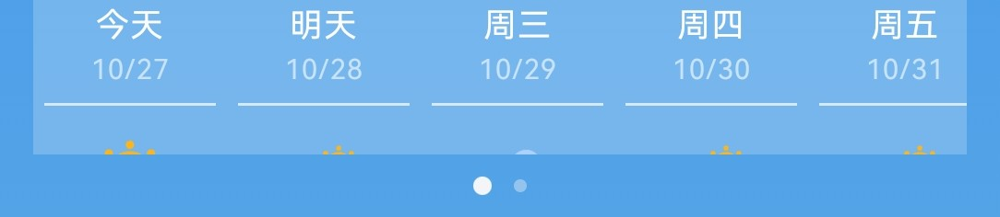

当用于添加多个城市之后，可以通过左右滑动切换显示的城市天气。
==如何添加城市，请看下面城市管理==

## 2、详细天气页面
当点击主页面的卡片或者通过**更多功能按钮**选择**天气信息**都会转跳到详细天气页面。
详细天气页面会显示选中城市天气的更多天气数据，包含了多个子页面，可以通过左右滑动或者之间点击上方的页面列表直接转跳。
#### 2.1、 实况天气页面

    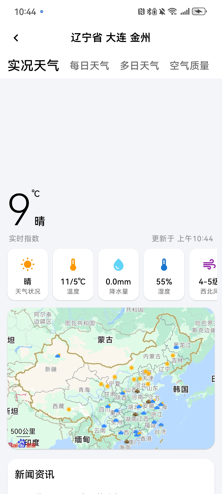

城市的实时天气数据，同时显示全国城市天气地图和实时新闻数据
### 2.2、每日天气页面

    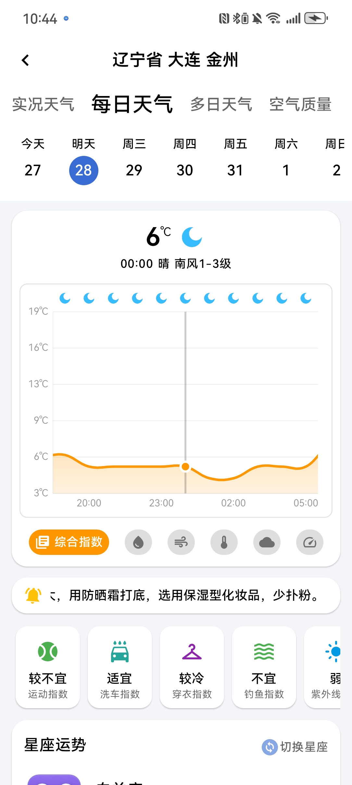

#### 2.2.1、逐小时天气预测图表

    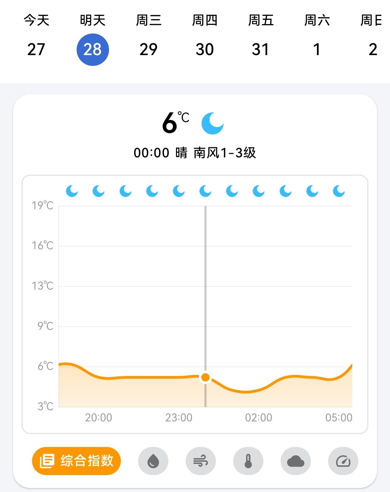

* **顶部**：时间列表，显示当前图表指针选中的日期，可以点击日期以切换图表中指针的位置。
* **中心**：显示详细的图表，包含一个指针，上面的文字显示会根据指针的变化而变换。图表支持拖动查看。
* **底部**：天气指数列表，用于选择当前图表中显示的天气指数信息，包含综合指数、降水量、体感温度、风力风向、云量、气压。
#### 2.2.2、生活指数列表

    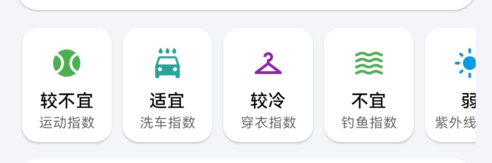

呈现一个生活指数列表，包含生活指数以及建议。
点击生活指数Item可以转跳到对应的Page。
#### 2.2.3、星座运势卡片

    

显示当天的星座运势信息，可以切换星座。

### 2.3、多日天气页面

    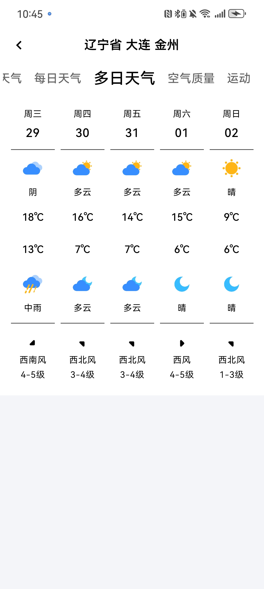

显示更多未来多日的天气信息

### 2.4、空气质量页面

    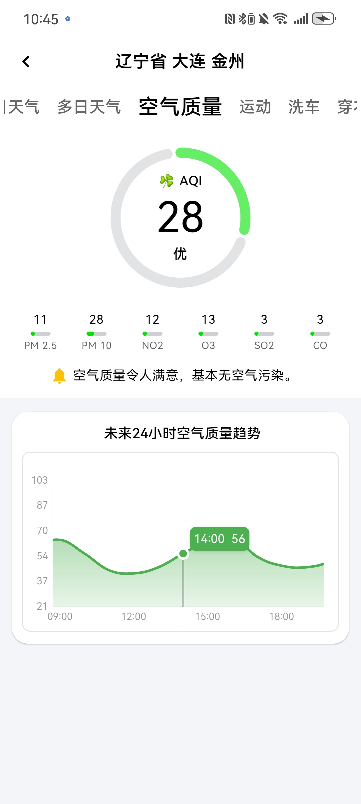

显示当前城市的实时空气质量信息。
下方图表显示未来24小时的空气质量趋势。

### 2.5、生活指数页面

    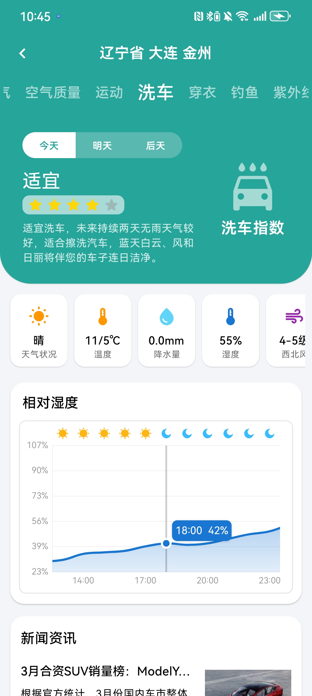

包含16种生活指数的页面。
提供对于未来3天的天气情况和生活实数的预测功能，同时，会显示相应的天气指数图标以及相关的新闻资讯。

## 3、搜索功能
### 3.1、搜索主页面
点击主页面的搜索按钮后，会转跳到搜索页面。

    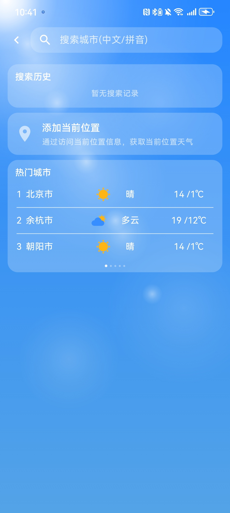

搜索页面包含如下几个部分：
* 搜索历史：显示历史搜索记录
* 添加定位按钮：如果添加的城市列表中不包含定位城市，则会显示此按钮，点击后，应用会将定位城市添加到城市列表中
* 热门城市列表：显示当前热门的15个城市，可以通过拖动切换page，点击城市后，会转跳到**添加城市页面**
### 3.2、添加定位城市
当点击添加定位按钮后，应用会请求开启定位权限，如果同意，会添加定位城市，并返回主页面显示此城市的天气信息。

    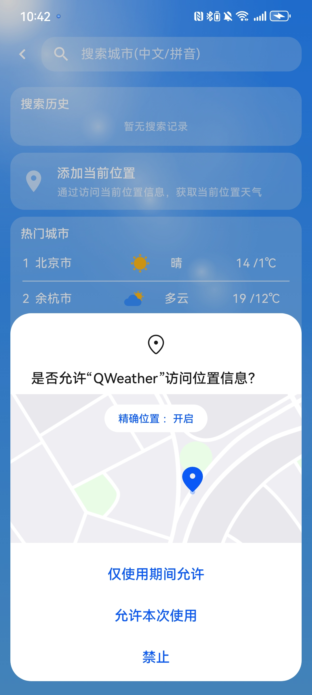

### 3.3、输入搜索
当在顶部输入框中输入查询的城市后，搜索页面会发生变换。

    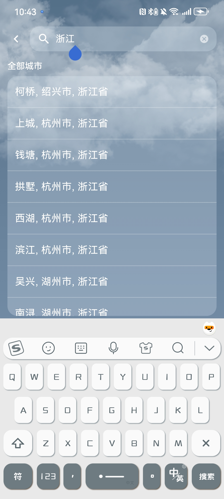

页面会显示查询到的城市列表，点击列表Item后会转跳到**添加城市页面**
### 3.4、添加城市页面
点击搜索结果的城市列表Item或者热门城市列表Ite都会转跳到此页面，显示对应城市的天气信息，同时提供一个**添加城市**的按钮。

    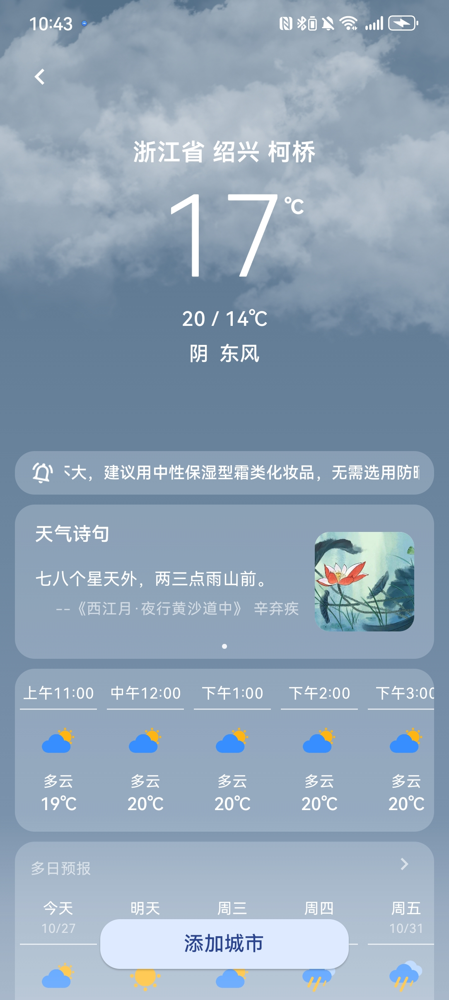

点击**添加城市**按钮后，会将该城市添加到**城市列表**中，并回到主页面
==城市列表 请详见城市管理部分==

## 4、城市管理
此应用会为用户管理一组城市列表。当用户点击主页面中城市名或者通过更多功能按钮的管理城市选项，都会转跳到**城市管理页面**
### 4.1、城市管理页面
城市管理页面会呈现出用户添加的城市列表，用户也可以通过点击添加城市按钮添加城市。

    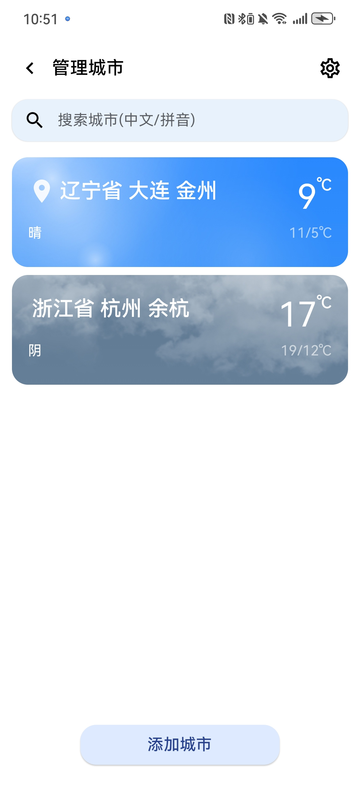

### 4.2、编辑城市页面
在城市管理页面中点击右上角的齿轮图标后，会转跳到编辑城市页面

    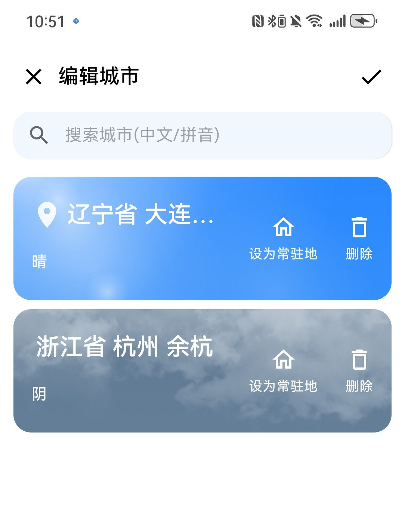

可以为城市设置一下类型：
* 常住地：常住地只能设置一个，下次重新打开应用后，主界面会优先显示常住地的天气信息。
* 定位点：当显示类型为定位点的城市时，应用会自动刷新定位信息并更新。
* 默认：无特殊功能。

编辑城市页面支持更改城市或者删除城市。

## 5、主题
此应用为天气设置了不同的主题背景
### 5.1、天气主题
主题会根据选中城市的天气情况自动变化。

    

    

主题包含：晴天、多云、阴、雨、雪
* 根据时间会设置白天和黑夜模式。
* 根据雨、雪的大小，背景的雨点和雪花的下落量会发生变化。

### 5.2、节气主题
如果当前为某个节气，那么，会显示相应的节气主题。

    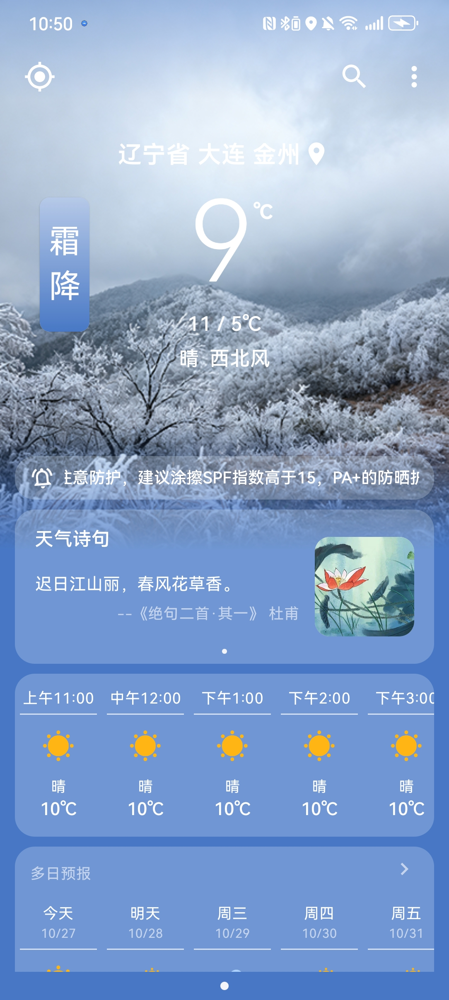

    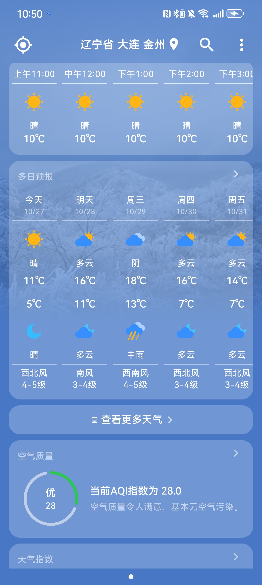

应用为不同的节气设置了不同的主题
另外，还能查看当天节气的详细介绍。

    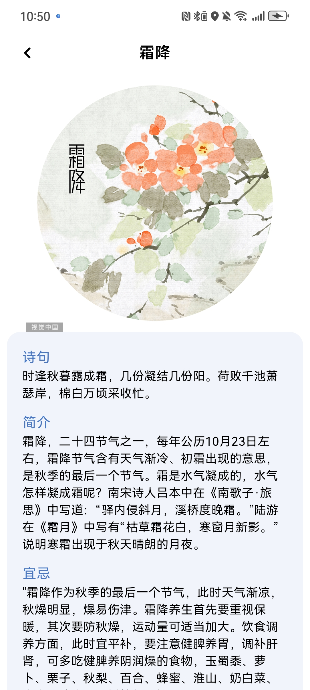

